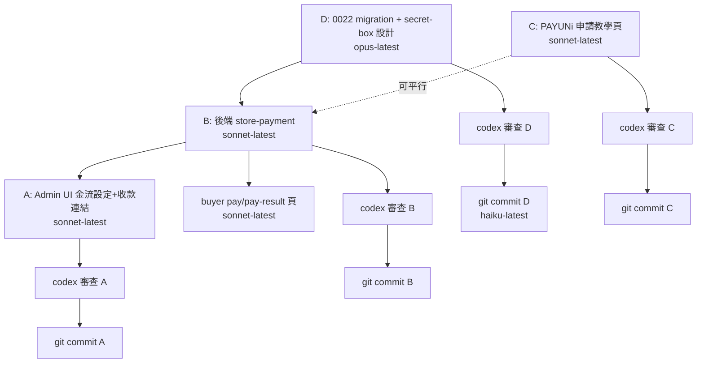

# 店主向買家線上收款（PAYUNi BYO Merchant）實作計畫

- 日期：2026-06-13
- 階段：**計畫（PLAN ONLY）** — 本文件不含任何程式碼/DB 變更，僅做設計與任務拆解
- 適用方案：**pro / proplus**（買家收款功能 gating）
- 金流模式：**PAYUNi、店主自帶商店帳號（BYO merchant）**；平台不代收代付、不當資金中介（規避台灣電子支付管理條例）

---

## 1. 現況校正節（已核對 codebase）

以下逐條核對業主提供的「既定事實」，標註 ✅ 相符 / ⚠️ 需修正補充：

| # | 既定事實 | 核對結果 |
|---|----------|----------|
| 1 | `src/shared/payuni.js` 的 `buildUppRequest(cfg, opts)`，`cfg={merId,hashKey,hashIv,sandbox}`，並有 `encryptInfo/decryptInfo/hashInfo` | ✅ 完全相符。`buildUppRequest` 在第 91 行，cfg 結構一致。**補充：另有 `verifyAndDecrypt(form, key, iv)`（第 117 行）已封裝「驗 HashInfo + 解 EncryptInfo」**，per-store 驗簽可直接複用，幾乎不用改加解密層。 |
| 2 | PAYUNi 目前只用於平台向店主收訂閱費，env 單一帳號，路由在 `/api/billing/*` | ✅ 相符。`src/routes/billing.ts` 用 `payuniConfig(env)` 讀 `PAYUNI_MER_ID/HASH_KEY/HASH_IV/SANDBOX`；路由在 `src/index.ts` 第 307–320 行（checkout/notify/return/order-status/orders）。Return/Notify URL 由 `env.APP_URL` 組出。 |
| 3 | 訂單表範本 `migrations/0021_payment_orders.sql`；active dir = `migrations/`；下一號 0022 | ✅ 相符。`ls migrations/` 最後為 `0021_payment_orders.sql`，下一號為 **0022**。`wrangler.toml` `migrations_dir="migrations"`。`workers/migrations/` 不動。 |
| 4 | stores 表有 subdomain/plan/description/template；**無 custom_domain、無店家金流欄位** | ✅ 相符。stores 建表在 0007，ALTER 散落於 0008/0009/0012/0013/0014/0017。`grep custom_domain` 全 repo 無命中；無任何 per-store 金流欄位。0017 有 `plan_paid_amount` / `plan_started_at`。 |
| 5 | 路由：proplus=子網域、pro/其他=`/s/{slug}`；wrangler routes 已涵蓋 | ✅ 相符。`src/index.ts` 子網域分支第 ~372 行：非 proplus 一律 302 轉回 `/s/{slug}`。`getEffectivePlan()`（`src/context.ts:55`）會把過期付費方案降為 free。wrangler routes 含 `vovosnap.com/*` 與 `*.vovosnap.com/*`。 |
| 6 | 買家端目前是「需求單」非付款；`success.html` 可作完成頁 | ✅ 相符。`/request.html`、`/success.html`、`/api/requirements` 為需求單流程；訂閱結果頁是 `billing-result.html`。**收款需新增買家付款頁，不可沿用需求單流程。** |
| 7 | domain 結論：用平台店面網址當賣場網址、Return/Notify 掛平台網域、NotifyURL per-store 驗簽 | ✅ 採用。詳見第 7 節。 |

### ⚠️ 需要在設計中特別處理的三個落差

1. **方案 gating 的 nuance**：`PAYABLE_PLANS = ["plus","pro","proplus"]`（`src/shared/billing-logic.js:4`），但業主要求買家收款**只開放 pro/proplus（排除 plus）**。需新增獨立判斷 `canUseStoreCollection(store)`，不可直接沿用 `PAYABLE_PLANS`。並且必須走 `getEffectivePlan()`（過期降 free 即自動停用）。

2. **共用 NotifyURL 的「分派金鑰」雞生蛋問題（關鍵安全設計）**：訂閱版的 notify 能直接 `verifyAndDecrypt` 是因為**只有一把 env 金鑰**。多店情境下，要先知道「是哪一家店」才能載入該店金鑰來驗簽，但訂單編號 `MerTradeNo` 是**包在加密的 `EncryptInfo` 內**，未驗簽/未解密前拿不到。因此「單一共用 endpoint」必須有一個**明文判別子**才能分派。詳見第 6.3 節的兩個方案（建議用 store-scoped NotifyURL，最穩、不依賴 PAYUNi 回傳明文欄位）。**此點列為待業主/PAYUNi 文件確認項。**

3. **沙盒測試**：`PAYUNI_SANDBOX="0"`（`wrangler.toml`），平台訂閱只有正式金鑰。但**店家收款的 sandbox 旗標是 per-store 的**（存在店家設定裡），與平台 env 無關，店主可各自用沙盒商店測試。設計需支援 per-store sandbox 切換。

---

## 2. 模型路由總表

| 階段 | 指派模型 | 用途 |
|------|----------|------|
| 大腦 / 統籌 | opus-4.8（本文作者） | 任務拆解、整合、衝突仲裁 |
| plan-write | opus-4.8 | 撰寫本實作計畫 |
| plan-review | **codex-reviewer**（業主指定 codex） | 跨模型審查本計畫（建議，見第 11 節） |
| db-schema | **opus-latest** | 0022 migration 設計與審查（含加密欄位方案） |
| coding | **sonnet-latest** | 後端、Admin UI、教學頁實作 |
| coding-audit | **codex-reviewer** | 每階段 commit 前安全審查（金鑰加密 / webhook 驗簽 / 金額竄改 / plan 繞過） |
| git-control | **haiku-latest** | 分階段 staging / commit |
| web-search | sonnet-latest | （如需）查 PAYUNi NotifyURL 明文欄位、手續費規則 |

> 覆寫規則：若業主對某階段指定不同模型，以業主指定為準。

---

## 3. 收款形態決策（MVP 範圍）

採 **「請款單 / 收款連結」** 模型，**不做購物車即時全額結帳**。理由：代購金流多為「訂金 → 採購 → 補尾款」、常退款，全額即時結帳不符實務。

- **MVP**：店主後台建立**單筆收款連結**（指定金額 + 品項描述）→ 系統產生 opaque 連結 → 店主把連結傳給買家 → 買家開啟 → 導 PAYUNi UPP 付款 → webhook 回更新訂單狀態 → 買家看完成頁。
- **後續階段（非 MVP）**：訂金 + 尾款拆單、部分退款、收款連結綁定到既有需求單、買家收據 email、自訂網域。

---

## 4. 架構總覽

```
店主(後台, 限 pro/proplus)
   │  1. 填 PAYUNi 三組金鑰 + sandbox/啟用旗標  →  加密存 D1
   │  2. 建立收款連結(金額/描述 server 端固定)    →  store_payment_orders
   ▼
買家(公開頁 /pay?o=<merTradeNo>)
   │  3. GET 公開訂單摘要(金額/描述, 不洩金鑰)
   │  4. POST 公開 checkout → 後端用「該店金鑰」buildUppRequest
   ▼
PAYUNi UPP 付款頁
   │  5. NotifyURL (server→server) → 共用 endpoint，per-store 驗簽 → 更新訂單
   │  6. ReturnURL (browser) → 依店方案導回正確店面結果頁
   ▼
買家完成頁
```

加解密層（`src/shared/payuni.js`）**零修改或近乎零修改**：只把 `cfg` 從 env 改成「該店解密後的金鑰」。

---

## 5. DB Schema 設計（階段 D，模型：opus-latest）

**產出檔**：`migrations/0022_store_payment.sql`
**輸入**：`migrations/0021_payment_orders.sql`（範本）、`migrations/0007_multi_tenant.sql`（stores/FK 模式）

### 5.1 表 A：`store_payment_configs`（店家金流設定，金鑰加密）

| 欄位 | 型別 | 說明 |
|------|------|------|
| `id` | INTEGER PK AUTOINCREMENT | |
| `store_id` | INTEGER NOT NULL UNIQUE | FK → stores(id) ON DELETE CASCADE |
| `provider` | TEXT NOT NULL DEFAULT 'payuni' | 預留多金流 |
| `mer_id_enc` | TEXT | **加密**儲存的 MER_ID |
| `hash_key_enc` | TEXT | **加密**儲存的 HASH_KEY |
| `hash_iv_enc` | TEXT | **加密**儲存的 HASH_IV |
| `enc_version` | INTEGER NOT NULL DEFAULT 1 | master key 輪替用 |
| `mer_id_hash` | TEXT | `sha256(mer_id)`，供「MerID 明文分派」方案做 O(1) 查找（見 6.3 方案 A）；不可逆、不洩明文 |
| `mer_id_last4` | TEXT | 後台顯示用（不需解密） |
| `sandbox` | INTEGER NOT NULL DEFAULT 0 | per-store 沙盒旗標 |
| `enabled` | INTEGER NOT NULL DEFAULT 0 | 啟用開關（店主測試通過才開） |
| `last_tested_at` | TEXT | 最近一次「測試連線」時間 |
| `last_test_status` | TEXT | ok / fail / null |
| `created_at` / `updated_at` | TEXT DEFAULT (datetime('now')) | |

索引：`UNIQUE(store_id)`；`CREATE INDEX idx_store_paycfg_merhash ON store_payment_configs(mer_id_hash)`（僅方案 A 需要）。

**加密方案（必做，金鑰絕不可明文進 D1）**：
- 新增 worker secret 作 master key，例如 `STORE_PAY_ENC_KEY`（`wrangler secret put`）。
- 寫一支 `src/shared/secret-box.js`（純函式，WebCrypto AES-GCM）：`seal(plaintext, masterKey) → {v, iv, ct}`、`open({v,iv,ct}, masterKey)`。每筆用**隨機 IV**，輸出 base64 串接（與 payuni.js 既有 hex 格式分開，避免語意混淆）。
- `enc_version` 對應 master key 版本，支援未來輪替（換 key 時重新 seal）。
- **注意**：payuni.js 既有 `encryptInfo` 是 PAYUNi 封包格式（key/iv 來自商店），**不可拿來當 at-rest 加密**，必須另寫 secret-box。

### 5.2 表 B：`store_payment_orders`（買家收款訂單，沿用 0021 模式）

| 欄位 | 型別 | 說明 |
|------|------|------|
| `id` | INTEGER PK AUTOINCREMENT | |
| `store_id` | INTEGER NOT NULL | FK → stores(id) ON DELETE CASCADE；index |
| `mer_trade_no` | TEXT NOT NULL UNIQUE | 含 store-collection 專屬前綴（如 `SC`）+ store_id 編碼，避免與訂閱單混淆、並支援 NotifyURL 分派 fallback |
| `kind` | TEXT NOT NULL DEFAULT 'single' | 預留 deposit/balance |
| `title` | TEXT NOT NULL | 買家看到的品項描述 |
| `amount` | INTEGER NOT NULL | **server 端設定**（TWD），buyer 不可改 |
| `currency` | TEXT NOT NULL DEFAULT 'TWD' | |
| `status` | TEXT NOT NULL DEFAULT 'pending' | pending / paid / failed / expired / cancelled |
| `buyer_email` | TEXT | 選填，作 UsrMail |
| `requirement_form_id` | INTEGER | 選填，連結既有需求單；FK SET NULL |
| `pay_type` | TEXT | 沿用 0021 |
| `payuni_trade_no` | TEXT | |
| `atm_bank_code` / `atm_account` / `atm_expire_at` | TEXT | ATM 取號（沿用 0021） |
| `raw_notify` | TEXT | 原始 notify JSON |
| `expires_at` | TEXT | 收款連結有效期（過期 → expired） |
| `created_at` | TEXT DEFAULT (datetime('now')) | |
| `paid_at` | TEXT | |

索引：`UNIQUE(mer_trade_no)`、`idx_store_payorders_store ON (store_id)`、`idx_store_payorders_status ON (status)`。

**驗收標準（D）**：
- `wrangler d1 migrations apply DB --local` 乾淨套用、可 rollback 思路清楚；
- 無明文金鑰欄位；
- FK / 索引齊全；
- codex-reviewer 針對「加密欄位設計、是否有明文洩漏路徑」審查通過。

---

## 6. 後端設計（階段 B，模型：sonnet-latest）

**新增路由前綴建議**：`/api/store-pay/*`（與既有 `/api/billing/*` 訂閱金流明確區隔），於 `src/index.ts` 註冊。
**新增檔案建議**：`src/routes/store-payment.ts`、`src/shared/secret-box.js`、`src/shared/store-payment-logic.js`（純函式，便於單測）。

### 6.1 店家金流設定 CRUD（後台 API，需登入 + plan gate）
- `GET /api/store-pay/config` — 回傳遮蔽後設定（`mer_id_last4`、sandbox、enabled、last_test_*），**絕不回金鑰明文**。
- `PUT /api/store-pay/config` — 接收三組金鑰 → `secret-box.seal` → 寫入；同時寫 `mer_id_hash`、`mer_id_last4`；存檔不自動 enable。
- `POST /api/store-pay/config/test` — 用解密後金鑰對 PAYUNi 做最小可行測試（如建立一筆 1 元 sandbox 交易或呼叫查詢 API），回 ok/fail，寫 `last_tested_at/last_test_status`。
- `POST /api/store-pay/config/enable` — 僅在曾測試成功後允許開啟 `enabled`。
- **gate**：以上全部先過 `canUseStoreCollection(getEffectivePlan(store))`（pro/proplus），否則 403。

### 6.2 收款連結（後台建立 + 公開付款）
- `POST /api/store-pay/orders`（後台，需登入+gate）：body `{title, amount, expiresInHours?, requirementFormId?}` → **server 端決定金額**，產生 `mer_trade_no`（SC 前綴+store_id 編碼）→ insert `store_payment_orders` → 回 opaque 付款連結。
- `GET /api/store-pay/orders`（後台）：本店收款單列表。
- `GET /api/store-pay/public/order?o=<merTradeNo>`（**公開、無登入**）：只回 `{title, amount, currency, status, storeName, expired}`，**不回金鑰、不回 store 機敏資料**；過期/取消回對應狀態。
- `POST /api/store-pay/public/checkout`（**公開**）：body `{o}` → 載該店設定 → `secret-box.open` 取金鑰 → 組 `cfg={merId,hashKey,hashIv,sandbox}` → 用**訂單裡 server 端的 amount** 呼叫 `buildUppRequest(cfg, {merTradeNo, tradeAmt: order.amount, returnUrl, notifyUrl, prodDesc, usrMail})` → 回 `{action, fields}` 供前端自動 submit。
  - **金額一律 server 端取自 DB**，前端傳來的任何金額一律忽略（呼應 wholesale 價外洩 / 「售價不可信前端」教訓）。
  - checkout 前檢查：店家 `enabled=1`、`getEffectivePlan` 仍為 pro/proplus、訂單 `pending` 且未過期。

### 6.3 共用 NotifyURL + per-store 驗簽（關鍵安全設計）
單一 endpoint：`POST /api/store-pay/notify`。難點：未驗簽前不知道是哪家店、載哪把金鑰。**兩個方案，建議 A→實作前先驗證 PAYUNi 行為，否則退 B**：

- **方案 A（明文判別子，需確認 PAYUNi 行為）**：若 PAYUNi notify form 含**明文 `MerID`**（多數金流會附），則 `sha256(MerID)` → 查 `store_payment_configs.mer_id_hash` → 載該店金鑰 → `verifyAndDecrypt(form, hashKey, hashIv)`。優點：真正單一 endpoint。風險：依賴 PAYUNi 是否回明文 MerID。
- **方案 B（store-scoped NotifyURL，最穩、payload 無關，建議預設）**：checkout 時把 NotifyURL 組成 `${APP_URL}/api/store-pay/notify?s=<storeId>`（或 path param）。endpoint 從 query 取 storeId → 載該店金鑰 → `verifyAndDecrypt`。仍是「同一個 handler / 路由」，符合業主「單一共用 endpoint」精神，但不靠 PAYUNi 回傳內容分派。**storeId 僅作分派提示，安全性仍由 HashInfo 驗簽保證**（偽造 storeId 但驗簽必失敗）。
- 兩方案共通：驗簽成功後，用解密出的 `MerTradeNo` 查 `store_payment_orders`（且 `store_id` 必須等於分派到的店），再做：
  - **金額比對**：`TradeAmt === order.amount` 否則標 failed（複用 `decideNotifyAction` 邏輯模式）；
  - **冪等 claim**：用 0021 同款「`UPDATE ... WHERE id=? AND status!='paid'` 檢查 `changes===1`」防雙重通知重複入帳；
  - 更新 paid / ATM 取號 / failed。

### 6.4 ReturnURL 導回正確店面
checkout 時依該店 `getEffectivePlan` 決定 ReturnURL：
- proplus：`https://{slug}.vovosnap.com/pay-result?o=...`
- pro：`https://vovosnap.com/s/{slug}/pay-result?o=...`
ReturnURL handler 同樣 `verifyAndDecrypt`，再 302 到買家完成頁（新頁，見第 8 節）。

**驗收標準（B）**：
- 純函式（金額比對、mer_trade_no 生成/解析、secret-box）有單測；
- 偽造金額 / 偽造 storeId / 重放 notify 皆被擋（測試或審查覆蓋）；
- 非 pro/proplus 或過期店家無法 checkout / 無法 enable；
- 任何回應都不洩漏金鑰；
- codex-reviewer 安全審查通過（重點：驗簽、金額竄改、plan 繞過、金鑰洩漏）。

---

## 7. Domain 區段（結論：**開店不需自有 domain**）

**結論**：店主開店與啟用收款**完全不需要自有 domain**。理由：
- 店面網址用平台既有路由即可：proplus = `{slug}.vovosnap.com`、pro = `vovosnap.com/s/{slug}`，wrangler routes 已涵蓋。
- PAYUNi 商店申請所需的「賣場網址」直接填平台店面網址。
- Return/Notify URL 一律掛平台網域（`APP_URL` / 子網域），server-to-server 的 NotifyURL 以第 6.3 的 per-store 驗簽處理，與店主是否有自有 domain 無關。

**自訂網域（custom domain）= 選配 / 後續，不擋金流上線**：
- 若未來要支援店主用自己的網域當店面，採 **Cloudflare for SaaS（custom hostnames）**：新增 stores.custom_domain 欄位 + Cloudflare custom hostname API 綁定 + 憑證簽發 + hostname 解析分支（`src/index.ts` 現行 hostname 判斷處擴充）。
- 此設計**不納入本次 MVP 必要路徑**，僅在計畫中備註做法，避免擋住收款上線。

---

## 8. 買家完成頁（含於階段 B/前端）
- 新頁 `public/pay-result.html`（可參考 `billing-result.html` / `success.html` 樣式），輪詢公開 order-status 顯示 paid/pending(ATM 取號)/failed。
- 公開付款頁 `public/pay.html`（讀 `?o=`，顯示金額/描述，按鈕觸發 checkout 自動 submit 到 PAYUNi）。
- **不可沿用需求單流程**（需求單非付款）。

---

## 9. Admin UI 與設計方式（階段 A，模型：sonnet-latest）

### 9.0 Tier gate（收款功能僅 pro / proplus）
- 唯一判定函式 `canUseStoreCollection(store)` = `getEffectivePlan(store) ∈ {"pro","proplus"}`。
  **用 `getEffectivePlan`（已會把過期付費方案降為 free），不可用原始 `store.plan`，也不可沿用含 plus 的 `PAYABLE_PLANS`。**
- **雙層 gate**：前端（UI 鎖定）+ 後端（每個 `/api/store-pay/*` 設定與請款 API 都先驗 `canUseStoreCollection`，回 403）。前端鎖定僅為體驗，安全靠後端。

### 9.1 過期 / 降級處理方式【業主已拍板：強制有效期 + 只完成進行中】
方案到期 → `getEffectivePlan` 自動回 `free` → 收款功能即時關閉。為避免「過期前預先囤大量長效連結繼續收款」的**付費授權繞過**（codex BLOCKER #2），採下列規則：

| 對象 | 過期後行為 |
|---|---|
| **建立新請款 / 收款連結** | **擋**（API 403、UI 鎖定）。 |
| **收款連結有效期** | 建立時**強制 `expires_at`**（上限 14 天，預設 7 天）。無「永久連結」。 |
| **尚未開始付款的舊連結** | **一律失效不可付**（即使 `expires_at` 還沒到，只要 `effective_enabled=false` 就擋 checkout）。 |
| **已 checkout、已送 PAYUNi 等 webhook 回拋的交易** | **允許完成**（NotifyURL 照常驗簽更新），不卡到已下單買家。判定依 `checkout_started_at IS NOT NULL`。 |
| **已存的金鑰設定** | **保留**（加密續存，標 inactive），續約免重填即恢復。**不因過期刪金鑰。** |
| **Admin 金流設定頁** | 轉唯讀 + 「方案已到期，續約以繼續使用收款」CTA（複用既有升級 box / `upgrade_click`）。 |

稽核欄位：order 記 `created_under_plan`、`checkout_started_at`、`plan_valid_until_at`。
> 續約後免重驗金鑰，但 UI 提示「請按一次測試連線確認」。

### 9.2 後台 UI 設計（沿用既有 admin 結構，不另起風格）
**落點**：`public/admin.html` 的 `<section data-tab="settings">`，在現有 sub-nav（基本 / 外觀 / 標籤 / 定價）**新增第 5 個 sub-tab「收款」**（`data-subtab="payment"` + `data-subtab-panel="payment"`），與既有分頁機制一致。

**面板內容（pro/proplus 才渲染表單，否則渲染鎖定卡）**：
- 鎖定態：複用 admin 既有 `plan-upgrade-box` / `eff` 判斷與 `upgrade_click` gtag 事件，顯示「Pro 以上才能開通線上收款」+ 升級 CTA + 連到教學頁。
- 表單態（`settings-group` 樣式，與定價頁一致）：
  1. **啟用收款** 開關（`is_enabled`）——僅「測試連線成功」後才允許開啟。
  2. **環境**：沙盒 / 正式 切換（`is_sandbox`）。
  3. **商店代號 (MER_ID)**、**Hash Key**、**Hash IV** 三組輸入；Hash Key/IV 用 `type=password`。
  4. **測試連線** 按鈕 → 呼叫 6.1 test endpoint，顯示成功/失敗狀態列（`admin-status`，比照 `display-status`）。
  5. 「查看 PAYUNi 申請教學」連結 → 第 10 節教學頁。
  6. 儲存按鈕 `saveStorePaymentSettings()`，與 `savePricingAll()` 同模式（回傳 promise、顯示已儲存狀態）。
- **金鑰 write-only 顯示原則**：載入時 server **只回遮罩狀態**（`mer_id` 顯示後 4 碼、Hash Key/IV 僅回「已設定 / 未設定」），**永不回明文**。儲存時空白欄位視為「不變更」，只更新有填的欄位。

**請款 UI（落在 `data-tab="orders"`）**：每筆訂單/需求單一個「產生收款連結」動作 → 輸入金額（預設帶 server 算出的應收）+ 描述 + 有效期 → 產生連結可複製/傳 LINE；列表顯示付款狀態（pending/paid/failed）。金額顯示僅供參考，**實際請款金額以 server 端 DB 為準**。

**驗收**：非 pro/proplus（含過期降級）前端鎖定 + 後端 403 雙擋；金鑰明文不在任何前端回應出現；過期後舊連結仍可付款、金鑰不被刪；新 sub-tab 與既有分頁切換/樣式一致。

---

## 10. 金流申請教學頁（階段 C，模型：sonnet-latest）
**產出**：靜態頁（建議 `public/guide/payuni-setup/index.html`，沿用 `public/guide/` 或 `public/blog/` 模板樣式）。
**參考文案**：EasyStore 的 PAYUNi 教學 <https://support.easystore.co/zh-tw/article/payuni-t9wker/>（**僅參考章節結構與口吻，不照抄**；該文是 EasyStore 專屬表單/年繳流程，我拍是店主**直接向 PAYUNi 申請**，需改寫）。
**文案口吻**：正式+親切，沿用「**小提醒**」式提示、操作步驟口語化（「點我登入」「點擊儲存，完成！」），強制性規定用明確語氣。

內容（步驟化，兩大段）：
- **步驟一：申請 PAYUNi 帳號**
  1. 為什麼要自行申請（平台不代收代付、店主自有金流帳號、款項直接進店主帳戶）。
  2. **以個人會員（自然人）為主**：個人預設信用卡額度約 20 萬元；公司（商業會員）約 100 萬元，兩者皆可申請。審核約 **14 個工作天**。
  3. 手續費級距（依方案約 **2.0%–2.2%**，以 PAYUNi 公告為準）；**PAYUNi 規定不得向購買人(買家)額外加收手續費** → 小提醒：手續費由店主自行吸收，不可轉嫁買家。
- **步驟二：在我拍後台啟用收款**
  4. 取得三組金鑰：**商店代號(MER_ID) / Hash Key / Hash IV** — 在 PAYUNi 後台「**會員 → 商店清單 → 選商店 → 商店明細 → 串接設定**」頁籤複製。截圖佔位。
  5. 填到我拍後台金流設定頁（對應第 9 節），按「測試連線」驗證。截圖佔位。
  6. 沙盒 vs 正式：沙盒需獨立測試商店帳號；正式上線前先做小額真實交易測試。

**驗收**：步驟完整、改寫自參考文（非照抄）、含截圖佔位與「個人為主/手續費不可轉嫁買家/沙盒 vs 正式」警語；不含任何真實金鑰；頁面有 meta/OG/canonical 並登記進 sitemap（沿用本次 SEO 慣例）。

---

## 11. Review / Audit gate（每階段 commit 前，模型：codex-reviewer）
依業主指定**改用 codex review**。每階段（D / B / A / C）commit 前各跑一次 `codex-reviewer`，安全重點：
- 金鑰加密：secret-box 是否正確、有無明文落地路徑、master key 取得方式；
- webhook 驗簽：per-store 分派是否安全、HashInfo 驗簽是否在任何分支都先於信任 payload；
- 金額竄改：checkout/notify 金額是否一律 server 端、是否比對；
- plan 繞過：API 層是否獨立 gate（不只前端）、過期降級是否擋；
- 重放/雙重通知冪等。
**plan-review（本文件）**：建議在開工前先以 codex-reviewer 審本計畫一次（待業主同意；本次先交付計畫，未自動觸發）。

---

## 12. 依賴順序總覽



關鍵相依：**D（schema + 加密）必須最先**；B 依賴 D；A 與買家頁依賴 B；C（教學頁）可與 B 平行但內容須對齊最終後台欄位。每階段審查通過才 commit。

---

## 13. 風險與待業主確認事項

1. ~~**PAYUNi NotifyURL 明文欄位**（影響 6.3 方案 A/B 選擇）~~ **【已由現有程式碼解決，不再待確認】**：核對 `src/routes/billing.ts:handleBillingNotify` — 先 `verifyAndDecrypt(...)` 再讀 `data.MerTradeNo`，證明訂單編號**包在加密 `EncryptInfo` 內、解密後才拿得到**，未解密無法分派。故**確定採方案 B（store-scoped NotifyURL `?s=<storeId>`）**，不需等 PAYUNi 文件；安全由 per-store `HashInfo` 驗簽保證（偽造 storeId 驗簽必失敗）。方案 A 僅作日後選配優化，非必要。
2. ~~**PAYUNi 商店申請門檻**~~ **【已拍板】**：**個人與公司皆可，以個人（自然人）為主**。教學頁以個人會員為主軸（額度約 20 萬、審核約 14 工作天），公司會員（約 100 萬）並列說明。
3. ~~**手續費吸收方**~~ **【已拍板，採預設】**：店主自行吸收（BYO merchant，費用直接由店主與 PAYUNi 結算，平台不經手）；且依 PAYUNi 規定**不得向買家加收手續費**。
4. ~~**退款政策**~~ **【已拍板，採預設】**：MVP 不做線上退款（走線下/PAYUNi 後台），部分退款列後續。
5. ~~**加密 master key 保管**~~ **【已拍板，採預設】**：`STORE_PAY_ENC_KEY` 只存 Cloudflare secret，不入 git、不入 D1；輪替時用 `enc_version` 漸進重加密。
6. ~~**法規邊界**~~ **【已拍板，採預設】**：服務條款/隱私權加註「平台非資金中介、款項由店主自有 PAYUNi 帳戶收取」聲明（最終法務口徑由業主定稿）。
7. ~~**plan gating 對 plus**~~ **【已拍板】**：plus **不**開放買家收款，僅 pro/proplus；以獨立 `canUseStoreCollection` gate，不沿用 `PAYABLE_PLANS`。

> 全部待確認事項已關閉（#1 由程式碼解決、#2 業主拍板、#3–#7 採計畫預設並經業主確認）。計畫可進入實作。

---

## 14. 全域驗收定義（Definition of Done）

- pro/proplus 店主可在後台填 PAYUNi 三組金鑰、測試連線、啟用；plus/free 被前後端雙重擋下。
- 店家金鑰在 D1 **全程加密**，任何 API 回應與 log 都不洩漏明文金鑰。
- 店主可建立單筆收款連結（金額 server 端固定），買家可開連結完成 PAYUNi 付款。
- NotifyURL 共用 endpoint 能 per-store 正確驗簽、金額比對、冪等更新；偽造金額/storeId/重放皆失效。
- ReturnURL 依方案正確導回 proplus 子網域 / pro 路徑的完成頁。
- 過期降級（getEffectivePlan→free）自動停用收款。
- 教學頁上線，店主可自助完成申請→填鑰→測試。
- domain 結論文件化；自訂網域明列為後續選配、未擋 MVP。
- 每階段經 codex-reviewer 安全審查通過後才 commit；分階段 commit 由 haiku-latest 執行。
- 加解密層 `src/shared/payuni.js` 維持零/近零修改。

---

## 15. Codex plan-review 安全修訂（**實作必遵**，2026-06-13）
以下為 codex (gpt-5.5) plan-review 採納項，覆寫前述相關設計，實作時以本節為準。

### 15.1 訂單狀態機 + anti-replay（BLOCKER）
- `store_payment_orders.status` 為**嚴格狀態機**：`pending → paid | failed | expired | cancelled`；`paid/refunded/cancelled/expired` 為**終態**，notify 不得把終態改回 paid。
- notify 僅允許 `pending`（含 ATM 取號 pending）轉移；其他狀態一律忽略並回 200（避免 PAYUNi 重送）。
- 防重放：記錄並比對解密出的 PAYUNi `TradeNo`/auth no/交易時間；同一 `mer_trade_no` 不得被不同交易資料覆蓋；納入合理時間窗。
- 金額竄改防護：見 15.4 canonical parser。

### 15.2 金鑰 key lifecycle（BLOCKER）
- master key 改用 **keyring**：`STORE_PAY_ENC_KEY_V1`、`_V2`…（Cloudflare secret），不用單一 secret。寫入用 latest version，讀取依 `enc_version` 找對應 key。
- **AAD**（AES-GCM additional authenticated data）綁定 `store_id|provider|field_name|enc_version`，防 ciphertext 跨欄位/跨店搬移仍可解。
- **rotate job**：逐筆 decrypt(old)→encrypt(latest)→更新 enc_version。
- **compromise response**：停用所有 checkout、要求店主重填金鑰、稽核 raw access。**loss response**：無法復原 → UI/API 須能優雅處理 decrypt fail 並引導店主重填。

### 15.3 公開端點安全（MAJOR）
- 收款連結對外識別碼用**高 entropy `public_token`**（非可枚舉的 `mer_trade_no`/序列）；`mer_trade_no` 改 opaque，**不放 store_id**、不作安全依據。
- NotifyURL 分派：`?s=` 僅 key-lookup hint；**驗簽後**必用解密出的 `MerTradeNo` 查 DB，並強制 `order.store_id === s`。
- `/api/store-pay/public/*` 與 `/notify` 加 **rate limit**（IP + order + store 維度）；對 expired/cancelled/paid 訂單**快速拒絕、不進 PAYUNi build**。
- public 查詢回**最小資料**，不存在/無權/過期一律**一致錯誤**避免枚舉。

### 15.4 金額 / 幣別 / 環境（MAJOR）
- **canonical amount parser**：只接受正整數 TWD、範圍 `1..9999999`；建單 / checkout / notify **共用同一 parser**；一律 server 端 DB 取值，忽略前端 amount。
- 每筆 order 寫入 **`is_sandbox` snapshot**（非僅存在 config）；checkout 與 notify 都比對 `order.is_sandbox === config.is_sandbox`；切換環境後舊 pending 不可混用。

### 15.5 ReturnURL（MAJOR）
- **paid 狀態只能由 NotifyURL 更新**；ReturnURL 驗簽後僅導頁，完成頁只輪詢 server order-status，不信任 URL payload。

### 15.6 權限 / 稽核 / 狀態模型（MAJOR）
- 金流設定（`GET/PUT /api/store-pay/config`）**僅 store owner / billing role 可改**；改金鑰寫 **audit log**（actor、時間、is_sandbox、mer_id_last4），改後自動 disable 須 retest 才能 re-enable。
- 狀態分離：`is_enabled`（店主意圖）vs computed **`effective_enabled = is_enabled && plan_ok && config_valid`**；UI 區分「已設定但目前不可用」與「有效啟用」。

### 15.7 資料保存 / log 脫敏（MAJOR/MINOR）
- `raw_notify` **不存完整 payload**，只存 redacted allowlist：`MerTradeNo/TradeAmt/Status/PayType/TradeNo/時間/回應碼`；EncryptInfo 原文不長期保存。
- **redaction logger**：config/test、checkout、notify 的錯誤只回 generic code，不回 PAYUNi raw response；解密後的 secret 變數禁止被 JSON stringify 進 log。
- **retention/刪除**：刪店或關閉收款時金鑰可永久刪除；訂單/notify 個資定明確保存期限。

### 15.8 Schema 約束 / 雜項（MINOR）
- D1 加 check constraints：`amount > 0`、`status IN (...)`、`is_sandbox IN (0,1)`、`is_enabled IN (0,1)`、`currency = 'TWD'`。
- 移除裸 `mer_id_hash = sha256(mer_id)`（方案 B 不需要）；若日後採方案 A 改用 `HMAC(master-derived key, mer_id)`。
- 教學頁費率/額度/審核天數**不寫死為保證值**，標「以 PAYUNi 官方公告為準」。
- 法遵聲明補：店主為收款主體、平台非賣方/支付機構/履約保證、退款爭議由店主處理、個資處理目的與保存期限、禁售品停權條款。
